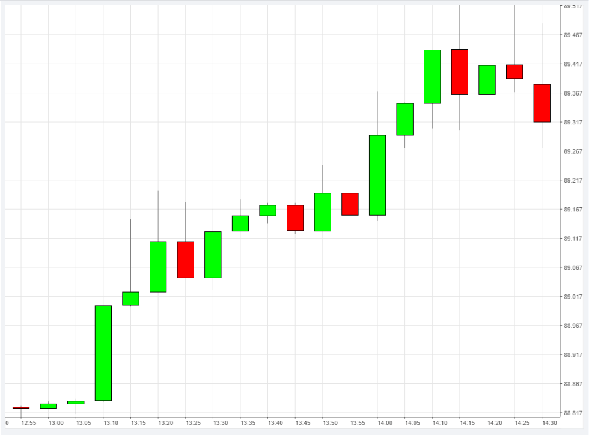

I'm a full stack javascript developer with over 4 years of experience in web development.

# Recent Side Projects

## 📰 [RSS To Telegram](https://t.me/ai_rss_to_telegram_bot)

Telegram RSS bot designed to deliver news in concise summaries and lets you translate them into your preferred language.

The project leverages a modern technology stack to provide a Telegram RSS bot service, which offers news summaries and translation features. The core technologies and services include:

- Language & Framework: Typescript, NestJS
- Database & ORM: Prisma, MongoDB Atlas
- Containerization & CI/CD: Docker, Github Actions, AWS
- Testing Framework: Jest
- Task Management & Messaging: Redis, BullMQ
- AI & Bot Library: OpenAI, Telegraf

## ✨ Cleaning Web Service

## 📈 [Candlestick Chart](https://candlestick-chart-nu.vercel.app/)

This project showcases a canvas-based candlestick chart, developed using vanilla JavaScript, and encapsulated withing a React application for straightforward deployment. Aimed at embedding withing messaging platforms for monitoring the exchange rates in real time.
