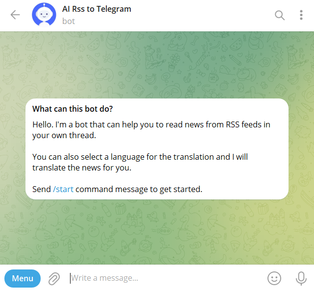

I'm a full stack javascript developer with over 4 years of experience in web development.

# Recent Side Projects

## 📰 [AI RSS To Telegram (2024)](https://t.me/ai_rss_to_telegram_bot)

Telegram RSS bot designed to deliver news in concise summaries and lets you translate them into your preferred language.

The project leverages a modern technology stack to provide a Telegram RSS bot service, which offers news summaries and translation features. The core technologies and services include:

- Language & Framework: Typescript, NestJS
- Database & ORM: Prisma, MongoDB Atlas
- Containerization & CI/CD: Docker, Github Actions, AWS
- Testing Framework: Jest
- Task Management & Messaging: Redis, BullMQ
- AI & Bot Library: OpenAI, Telegraf

[Access the Source Code](https://github.com/Ksenia0479/rss-to-telegram)

## ✨ [Cleaning Web Service (2020)](https://cleaning-web-service-client.vercel.app/)

Online job platform aiming to connect cleaning companies and individuals at home providing the ease of scheduling and monitoring to their users.

Here are some of implemented features:

- creating/reading/updating/removing user account
- email verification using JWT
- infinite scrolling (data pagination)
- monitoring upcoming/completed/canceled orders
- company review
- sending email/web push notifications
- sorting/filtering company/order data

The following core technologies are used:

- Language and Frameworks: Javascript, React (Frontend), Express (Backend)
- Database Management: MongoDB with Mongoose
- Frontend Design and Technologies: HTML5, CSS3, Flexbox for responsive design
- Deployment and Hosting: Heroku
- State Management: Redux

[Access the Source Code](https://github.com/Ksenia0479/cleaning-web-service/tree/main/client)

## 📈 [Candlestick Chart (2018)](https://candlestick-chart-nu.vercel.app/)

This project showcases a canvas-based candlestick chart, developed using vanilla JavaScript, and encapsulated withing a React application for straightforward deployment. Aimed at embedding withing messaging platforms for monitoring the exchange rates in real time.

[Access the Source Code](https://github.com/Ksenia0479/candlestick-chart/blob/main/client/src/App.js)
